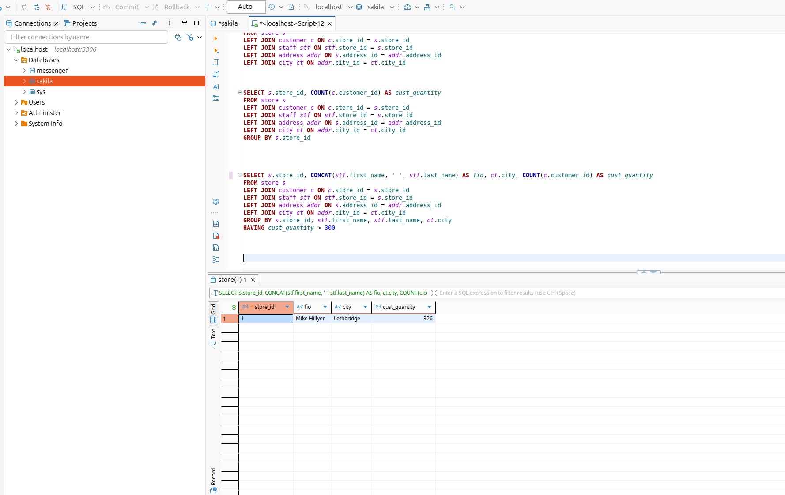
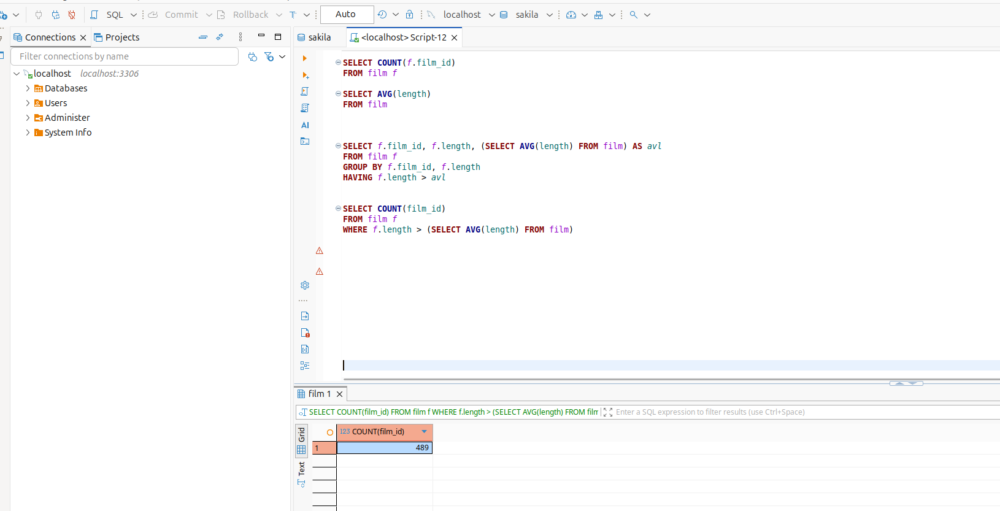
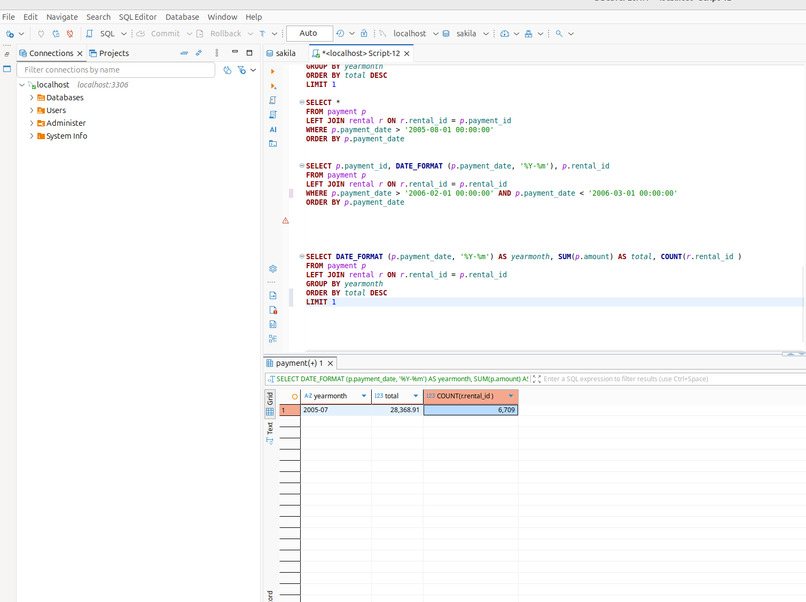
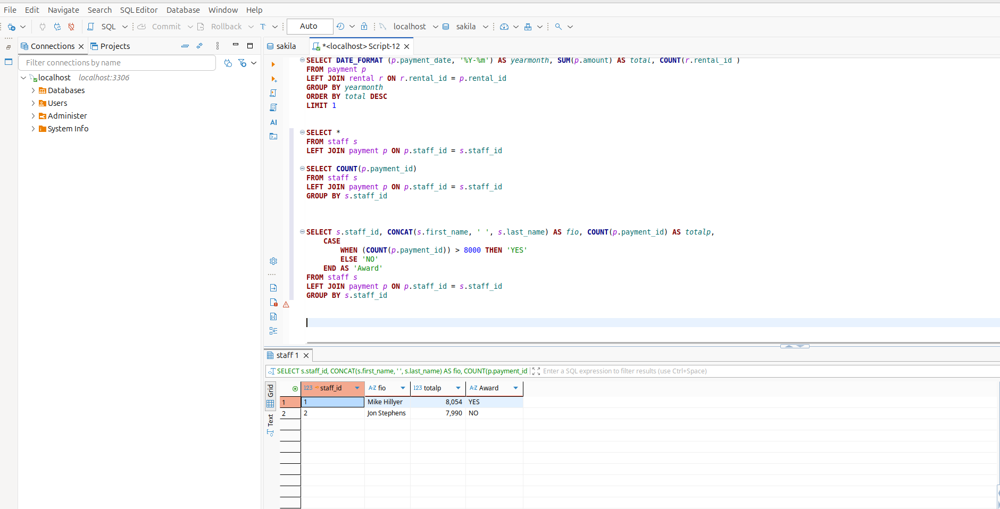
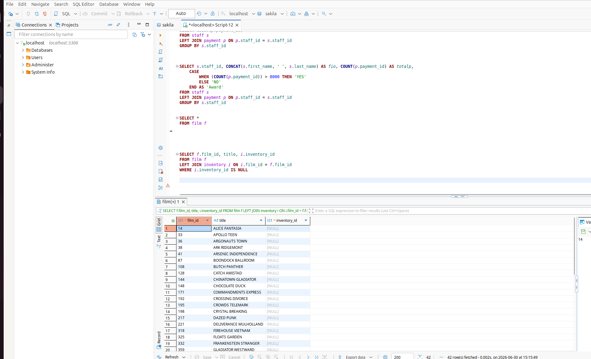

# Практическое задание по занятию "Расширенные возможности SQL" Дедяхин Игорь

### Задание 1

Одним запросом получите информацию о магазине, в котором обслуживается более 300 покупателей, и выведите в результат следующую информацию: 
- фамилия и имя сотрудника из этого магазина;
- город нахождения магазина;
- количество пользователей, закреплённых в этом магазине.

### Решение
 
 Скрипт:
```SQL
SELECT s.store_id, CONCAT(stf.first_name, ' ', stf.last_name) AS fio, ct.city, COUNT(c.customer_id) AS cust_quantity
FROM store s
LEFT JOIN customer c ON c.store_id = s.store_id
LEFT JOIN staff stf ON stf.store_id = s.store_id
LEFT JOIN address addr ON s.address_id = addr.address_id
LEFT JOIN city ct ON addr.city_id = ct.city_id
GROUP BY s.store_id, stf.first_name, stf.last_name, ct.city
HAVING cust_quantity > 300

```


Результат выполнения:




---

### Задание 2

Получите количество фильмов, продолжительность которых больше средней продолжительности всех фильмов.

 Скрипт:
```SQL
SELECT COUNT(film_id)
FROM film f
WHERE f.length > (SELECT AVG(length) FROM film)
```
Результат выполнения:




### Решение

---

### Задание 3

Получите информацию, за какой месяц была получена наибольшая сумма платежей, и добавьте информацию по количеству аренд за этот месяц.

### Решение

 Скрипт:
```SQL
SELECT DATE_FORMAT (p.payment_date, '%Y-%m') AS yearmonth, SUM(p.amount) AS total, COUNT(r.rental_id ) 	
FROM payment p
LEFT JOIN rental r ON r.rental_id = p.rental_id 
GROUP BY yearmonth
ORDER BY total DESC
LIMIT 1

```
Результат выполнения:



---


## Дополнительные задания (со звёздочкой*)
Эти задания дополнительные, то есть не обязательные к выполнению, и никак не повлияют на получение вами зачёта по этому домашнему заданию. Вы можете их выполнить, если хотите глубже шире разобраться в материале.

### Задание 4*

Посчитайте количество продаж, выполненных каждым продавцом. Добавьте вычисляемую колонку «Премия». Если количество продаж превышает 8000, то значение в колонке будет «Да», иначе должно быть значение «Нет».

### Решение

```SQL
SELECT s.staff_id, CONCAT(s.first_name, ' ', s.last_name) AS fio, COUNT(p.payment_id) AS totalp,
	CASE
		WHEN (COUNT(p.payment_id)) > 8000 THEN 'YES'
		ELSE 'NO'
	END AS 'Award'	
FROM staff s
LEFT JOIN payment p ON p.staff_id = s.staff_id
GROUP BY s.staff_id
```

Результат выполнения:



---

Посчитайте количество продаж, выполненных каждым продавцом. Добавьте вычисляемую колонку «Премия». Если количество продаж превышает 8000, то значение в колонке будет «Да», иначе должно быть значение «Нет».

### Задание 5*

Найдите фильмы, которые ни разу не брали в аренду.

### Решение

```SQL
SELECT f.film_id, title, i.inventory_id
FROM film f 
LEFT JOIN inventory i ON i.film_id = f.film_id
WHERE i.inventory_id IS NULL
```

Результат выполнения:



---
